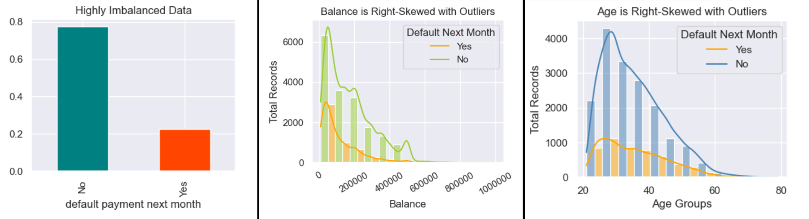
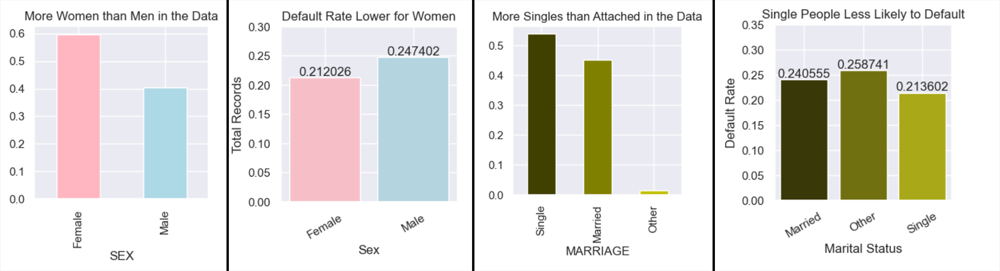
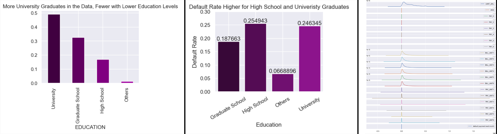
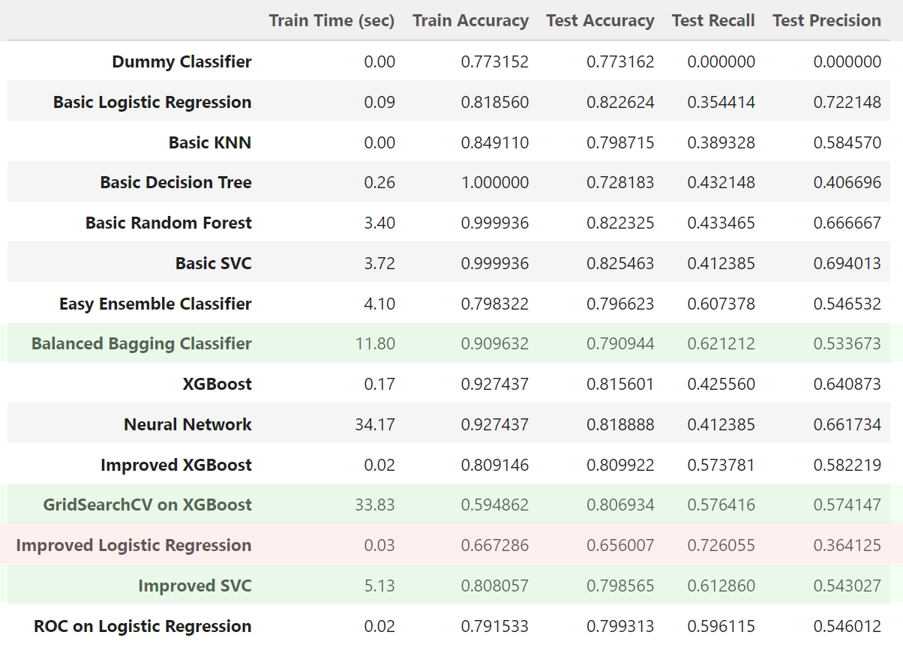
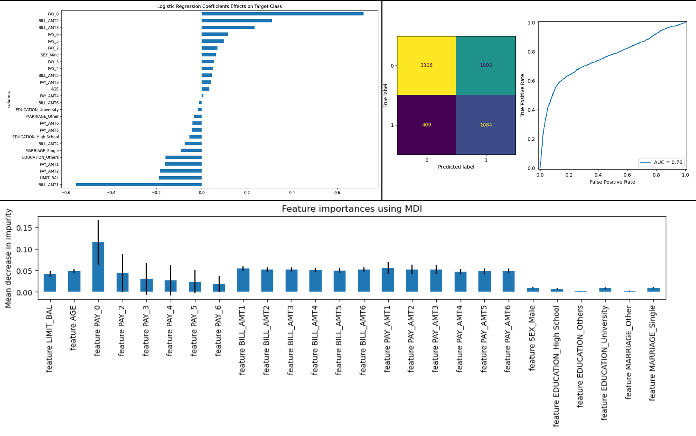

# Machine Learning Classification Model for Credit Card Defaults

The purpose of this project is to detect credit card defaults with machine learning classifiers and build an efficient classifier to identify bank customers who would default next month. It is a binary classifier problem, and the data has taken from ["Default of Credit Card Clients Data Set"](https://code.datasciencedojo.com/datasciencedojo/datasets/tree/master/Default%20of%20Credit%20Card%20Clients) where itself comes from UC Irvine's [UCI Machine Learning Repo](https://archive.ics.uci.edu/dataset/350/default+of+credit+card+clients).

# Jupyter Notebooks
The accompanied Jupyter Notebooks provide the exploratory data analysis (EDA), calculations, methodologies, and different classifier models performance comparisons. The first iteration and EDA are within the [EDA Notebook](capstone.ipynb), and the follow up iterations, EDA expansions, and improvements are presented in [Capstone Notebook](capstone_final.ipynb).

# Exploratory Data Analysis and Data Cleaning
This dataset is relatively clean with no missing values and no duplicates. There were originally 30,000 rows and 24 features (excluding ID) in the dataset. 

## Data Cleaning Steps:

1. ID column was dropped.
2. MARRIAGE column according to the legend should have had values between 1 and 3, but there were rows that has 0 in them. These rows were updated to 3 to represent OTHERS category.
3. EDUCATION column supposed to have values from 1-4, but we see values 0, 5, and 6. These values were all converted to OTHERS or 4.
4. BILL_AMT1 through BILL_AMT6 columns all had negative values. All rows were dropped who had negative values for any BILL_AMT columns.
5. Since all columns are represented with numerical values, and some of just categories, these columns are converted back to categorical columns: SEX, MARRIAGE, and EDUCATION as objects.

## EDA Insights:
1. Data is highly imbalanced. We need to use appropriate measures like F1 or Recall instead of Accuracy. Imbalance data needs to be under-sampled or oversampled so models like Logistic Regression do not eliminate the small class. SVC needs to have balance parameter.
2. There are correlations between features. PAY_0 has increasing correlation gradually up tp PAY_6, as well as BILL_AMT1 up to BILL_AMT6.
3. LIMIT_BAL column is right-skewed with outliers as seen in below picture, so it was trimmed to balances under $610,000. There was also one anomaly at $327,680 in this column, which did not correspond to any other datapoints spacing at even $10,000 bins. This datapoint was removed in ***Outliers Removal*** section.
4. Age distribution is right-skewed, but the mean is similar for each group (outliers greater than 72 were removed).

6. Gender has an impact on the rate of defaults. Although there are more women in the dataset, they have lower default rates than men.
7. Marital status also impacts default rates. Single people are less likely to default than married people.

9. Education also impacts default rates. Post graduate degree holders are less likely to default than high school graduates and basic University degree holders.
10. The data also shows different scales among columns, and proper scaling techniques needs to be used so there are no issues with the models. For more details about scaling, please view the accompanied Jupyter notebook. 

After clean up, the data has 22306 rows and 24 columns (originally all numerical and finally 21 numerical and 3 categorical). The data is highly imbalanced with 77.3% non-default and only 22.7% default cases as seen in below image. Since we aim to classify and find default customers, this imbalance data poses some difficulties, and the data needs to be handled with case.

Other than scaling, it is note worthy to mention that some of the columns are highly correlated to each other. Columns PAY_0 to PAY6 and BILL_AMT1 to BILL_AMT6 are gradually correlated among each other as seen in the correlation matrix in the notebook. For encoding categorial columns, ***pd.get_dummies*** is used, and ***StandardScaler*** class is used to scale the other columns. The data has been split into training and test sets by a ratio of 70%/30% which is 15614 training rows and 6692 test rows. The ***Dummy Classifier*** returns 77.3% accuracy on this data so any model has to beat this value to be considered worthy.

# Model Comparisons

In this project, we managed to train and compare 14 machine learning models: 5 Basic models, XGBoost Model, Nueral Network Model, 3 improved models, 1 GridSearchCV on XGBoost, 1 ROC on Logistic Regression, and 2 Ensemble models as seen in the table below. For reasons to be explained soon, ***XGBoost GridSearchCV***, ***Balanced Bagging***, and ***Improved SVC*** resulted in the best performances.

# Result Analysis

Although all basic models beat the ***Dummy Classifier*** performance, because of the imbalance dataset, we can see that ***Accuracy*** is not the right measure to compare their performances. These models all show poor ***Recall*** and ***Precision*** scores, so to compare the best model, we have to use either ***Recall*** or ***F-1*** scores. The reason for this is that poor recall scores result in a large number of ***false negative*** cases, meaning a large number of customers who are likely to be defaulted will be classified as safe resulting the bank to lose money.

# Improved Models
A plethora of hyper-parameter tuning and feature reduction techniques is used to create the improved models. The ***Improved XG-Boost*** Model is tuned with ***scale_pos_weight*** and some other important parameters, and finally a GridSearch Cross Validation is performed to find the best parameters.

Other improved models are based on the feedback from the coefficients of the ***Logistic Regression*** model (below image top-left) and ***Random Forrest*** non-linear correlations (below image bottom-side) to choose a subset of original features albeit more important ones. ROC is performed on a Logistic Regression model by changing the probability values for the ***false positive*** rate (below image on right-side). ***Improved SVC*** is hyper-parameter tuned by balanced data and feature reduction. 

We can see that GridSearchCV results in one of the best models, but it takes a long time to converge. ***Improved SVC*** classifier actually has very good ***Recall*** score and of the best training time there.

Lastly, although ***Improved Logistic Regression*** results in best ***Recall*** score, unfortunately the accuracy of that model is below the dummy classifier. Depend on the bank available processing resources, this model may actually be more useful since it has the lowest ***False Negative*** rate meaning more people likely to default are detected by the model. 

# Ensemble Techniques
Two ensemble classifiers are chosen for imbalanced data, ***Easy Ensemble*** and ***Balanced Bagging***. Both have performed nicely on this dataset with good recall score. 

# Neural Network
Neural Network model performance is in par with the default XGBoost model, therefore, if we spend time hyper-parameter tuning it, it should perform as good as other models, but due to the training time, this model is not very cost efficient.

# Conclusion
The dataset is not perfect, so we cannot have 100% accuracy and 100% recall on our classification problem. Because it is imbalanced, there are a number of methods that are common to process the data:

1. Using better scoring measures like F-1
2. Up sampling the data
3. Down sample and clustering the data.
4. A combination of methods

As noted earlier, having a low recall score means some default customers will be classified as normal, and the bank cannot detect them. This can have major implications. Therefore, a balanced Recall and Accuracy is suggested for this problem. Both SVC and Easy Ensemble classifiers results fall in this category. 

Further advice for the customer would be to gather more data and more features. The performance of any model on this dataset is bound by the data limitations.
