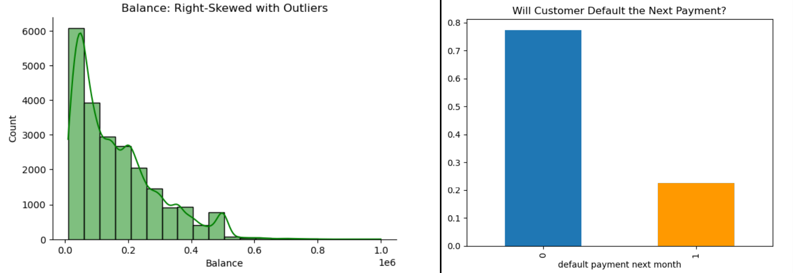
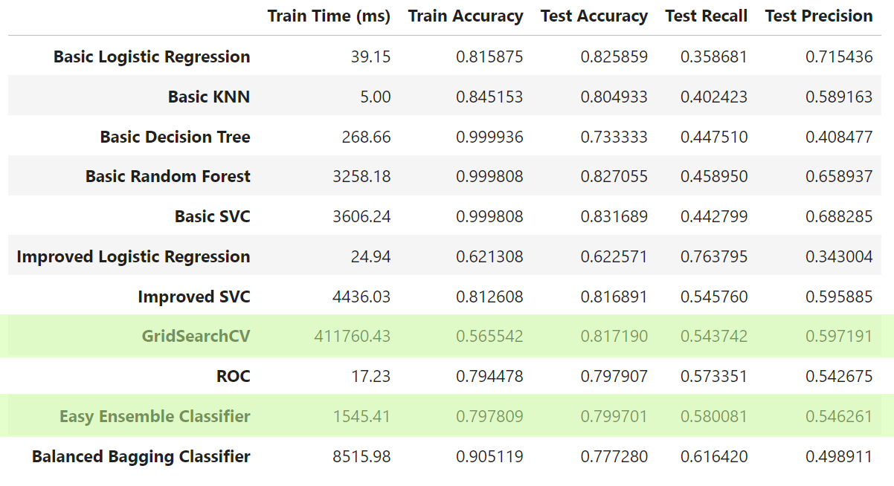

# Machine Learning Classification Model for Credit Card Defaults

The purpose of this project is to detect credit card defaults with machine learning classifiers and build an efficient classiier to identify bank customers who would default next month. It is a binary classifier problem, and the data has taken from ["Default of Credit Card Clients Data Set"](https://code.datasciencedojo.com/datasciencedojo/datasets/tree/master/Default%20of%20Credit%20Card%20Clients) where itself comes from UC Irvine's [UCI Machine Learning Repo](https://archive.ics.uci.edu/dataset/350/default+of+credit+card+clients).

# Jupyter Notebooks
The accompanied [Jupyter Notebook](capstone.ipynb) provides the exploratory data analysis, calculations, methodologies, and different classifier models performance comparisons.

# Exploratory Data Analysis and Data Cleaning
This dataset is relatively clean with no missing values and no duplicates. There were originally 30,000 rows and 24 features (excluding ID) in the dataset. Cleaning the data involved following steps:

1. ID column was dropped.
2. MARRIAGE column according to the legend should have had values between 1 and 3, but there were rows that has 0 in them. These rows were updated to 3 to represent OTHERS category.
3. EDUCATION column supposed to have values from 1-4, but we see values 0, 5, and 6. These values were all converted to OTHERS or 4.
4. BILL_AMT1 through BILL_AMT6 columns all had negative values. All rows were dropped who had negative values for any BILL_AMT columns.
5. LIMIT_BAL column is right-skewed with outliers as seen in below picture, so it was trimmed to balances under $600,000.
6. Since all columns are represented with numerical values, and some of just categories, these columns are converted back to categorical columns: SEX, MARRIAGE, and EDUCATION as objects.

After clean up, the data has 22299 rows and 24 columns (originally all numerical and finally 21 numericals and 3 categorical). The data is highly imbalanced with 77.3% non-default and only 22.7% default cases as seen in below image. Since we aim to classify and find default customers, this imbalance data poses some difficulties, and the data needs to be handled with case.

The data also shows different scales among columns, and proper scaling techniques needs to be used so there are no issues with the models. For more details about scaling, please view the accompanied Jupyter notebook. Other than scaling, it is northworthy to mention that some of the columns are highly correlated to each other. Columns PAY_0 to PAY6 and BILL_AMT1 to BILL_AMT6 are gradually correlated among each other as seen in the correlation matrix in the notebook.

For encoding categorial columns, ***pd.get_dummies*** is used, and ***StandardScaler*** class is used to scale the other columns. The data has been splitted into training and test sets by a ratio of 70%/30% which is 15609 training rows and 6690 test rows. The ***Dummy Classifier*** returns 78% accuracy on this data so any model has to beat this value to be considered worthy.

# Model Comparisons

During our EDA phase, we managed to create and compare 5 Basic models, 2 improved models, 1 GridSearchCV, 1 ROC, and 2 Ensemble models as seen in table below, but as for reasons to be explained soon, GridSearchCV and EasyEnsumble resulted in best performances.

